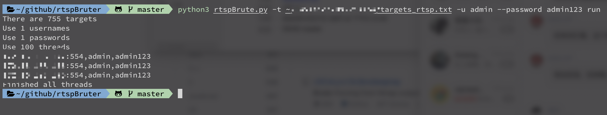

## Install

```python
python3 -m pip install -r requirements.txt
```

## Usage

```python3
python3 rtspBrute.py -t ./targets_rtsp.txt -u admin --password admin123 run
```

## Screenshot




## Documents

##### NAME

​    rtspBrute.py - RtspBrute

##### SYNOPSIS

​    rtspBrute.py --target=TARGET --username=USERNAME --password=PASSWORD <flags>

##### DESCRIPTION

​    RtspBrute is a RTSP(Real Time Streaming Protocol) brute tool.

    Example:
        python3 oneforall.py -t 127.0.0.1  -u admin --password admin123  run
        python3 oneforall.py -t 127.0.0.1,127.0.0.2  -u ./username.txt --password admin123456 run
        python3 oneforall.py -t ./targets.txt  -u admin --password admin123 --port 555 run

##### ARGUMENTS

​    TARGET
​        ip:port or file example:127.0.0.1:554 127.0.0.2:554 or ./targets.txt
​    USERNAME
​        username or username file
​    PASSWORD
​        password or password file

##### FLAGS

​    --port=PORT
​        default port 554